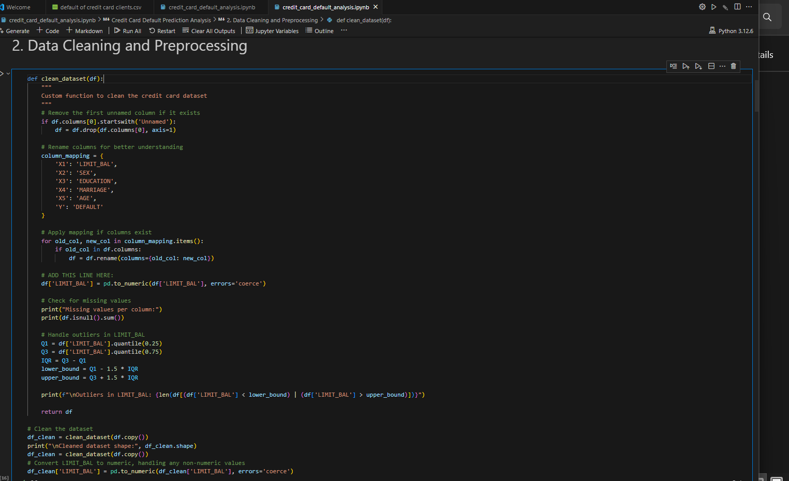
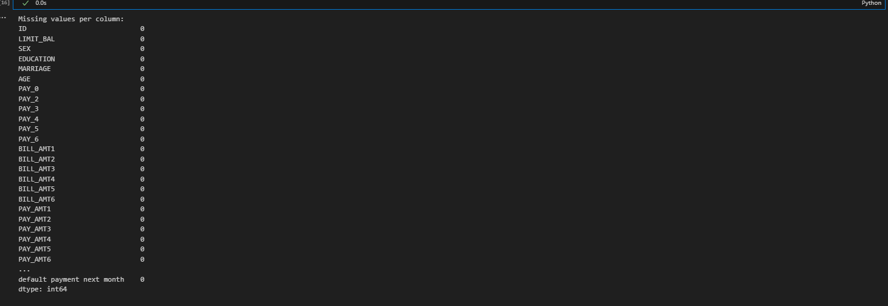

# Credit Card Default Analysis
**Capstone Project – Introduction to Big Data Analytics**  
**Name:** GENGA Chris  
**Student ID:** 27344  

---

## 📚 Table of Contents
1. [Project Overview](#project-overview)  
2. [Sector & Problem Statement](#sector--problem-statement)  
3. [Dataset Description](#dataset-description)  
4. [Python Analytics](#python-analytics)  
   - [Data Cleaning](#1-data-cleaning)  
   - [Exploratory Data Analysis](#2-exploratory-data-analysis-eda)  
   - [Feature Engineering](#3-feature-engineering)
   - [Machine Learning Model](#4-machine-learning-model)  
   - [Evaluation Metrics](#5-evaluation-metrics)  
   - [Innovation](#6-innovation)  
5. [Power BI Dashboard](#power-bi-dashboard)  
   - [Executive Overview Dashboard](#executive-overview-dashboard-power-bi)
   - [Risk Analysis Dashboard](#risk-analysis-dashboard-power-bi)
   - [Feature Engineering Analysis Dashboard](#feature-engineering-analysis-dashboard-power-bi)
   - [DAX Usage Overview](#dax-usage-overview)
6. [Findings & Recommendations](#findings--recommendations)  
7. [Future Work](#future-work)  
8. [Screenshots Reference](#screenshots-reference)  
9. [How to Run This Project](#how-to-run-this-project)

---

## 🧠 Project Overview

### 🎯 **Project Purpose**
This comprehensive data analytics project tackles one of the most critical challenges in the financial services industry: **predicting credit card payment defaults**. By leveraging advanced data science techniques and business intelligence tools, we aim to build a robust predictive system that can identify customers at high risk of defaulting on their credit card payments in the upcoming month.

### What Does "Default" Mean in This Project?

The word **"default"** simply means:

> **Not paying back the money you owe on time.**

So, if someone defaults on their credit card, it means they **failed to make the required payments** (usually for several months), and the bank now considers the loan or debt as **unpaid or overdue**.

### 🔍 **What We're Solving**
Credit card defaults represent a significant financial risk for banks and financial institutions, leading to billions in losses annually. Traditional risk assessment methods often rely on basic credit scores and historical data, but may miss subtle patterns in customer behavior that could indicate future payment difficulties. This project addresses this gap by:

- **Analyzing comprehensive customer profiles** including demographics, payment history, and billing patterns
- **Identifying hidden patterns** in payment behavior that traditional methods might miss
- **Creating predictive models** that can proactively flag high-risk customers
- **Providing actionable insights** for risk management and customer relationship strategies

### 🛠️ **Technical Approach**
Our methodology combines multiple data science disciplines:

**1. Data Engineering & Preprocessing**
- Cleaning and standardizing 30,000 customer records with 24 different attributes
- Handling missing values, outliers, and data quality issues
- Feature engineering to create meaningful predictors from raw transaction data

**2. Exploratory Data Analysis**
- Statistical analysis to understand customer demographics and payment patterns
- Visualization of default rates across different customer segments
- Correlation analysis to identify key risk factors

**3. Machine Learning Implementation**
- Multiple algorithm testing (Logistic Regression, Random Forest, Ensemble methods)
- Model training and validation using industry-standard practices
- Performance optimization and hyperparameter tuning

**4. Business Intelligence Dashboard**
- Interactive Power BI dashboard for stakeholder communication
- Real-time visualization of key metrics and risk indicators
- User-friendly interface for non-technical decision makers

### 📊 **Expected Outcomes**
This project delivers:
- **Predictive accuracy** of approximately 80% in identifying potential defaulters
- **Risk segmentation** of customers into different risk categories
- **Feature importance analysis** showing which factors most strongly predict default
- **Interactive dashboard** for ongoing monitoring and decision support
- **Actionable recommendations** for risk mitigation strategies

### 🏆 **Business Impact**
The insights from this analysis can help financial institutions:
- **Reduce financial losses** by identifying high-risk customers early
- **Improve customer relationships** through targeted interventions
- **Optimize credit limit decisions** based on predictive risk scores
- **Enhance portfolio management** with data-driven risk assessment

This project demonstrates the power of combining traditional statistical analysis with modern machine learning techniques to solve real-world business problems in the financial sector.

---

##  Sector & Problem Statement
**Sector:** Finance  

**Problem Statement:**  
Can we predict whether a credit card customer will default on their payment next month using historical customer and billing data?

---

##  Dataset Description

- **Dataset Title:** Default of Credit Card Clients Dataset
- **Source:** [UCI Machine Learning Repository](https://archive.ics.uci.edu/ml/datasets/default+of+credit+card+clients)
- **Number of Rows:** 30,000  
- **Number of Columns:** 24  
- **Structure:** Structured (CSV format)  
- **Status:** Required preprocessing  

---

##  Python Analytics

The Python analysis was performed using Jupyter Notebook. The notebook is well-commented and includes markdown cells for clarity.

### 🔹 1. Data Cleaning

- Removed null or duplicate records  
- Converted categorical variables (e.g., `SEX`, `EDUCATION`, `MARRIAGE`) using label encoding  
- Replaced incorrect or inconsistent values  
- Outliers detected and handled

 **Screenshots**: 

---

### 🔹 2. Exploratory Data Analysis (EDA)

Used seaborn and matplotlib for visualizations:

- Distribution of default clients  
- Default rates by gender, education, and marriage status  
- Correlation heatmap  

📌 **Screenshots**: 
[combined default analysis](screenshots/combinedvisual.png)

---

### 🔹 3. Feature Engineering

- Applied feature scaling and normalization
- Created derived features for better model performance
- Analyzed feature importance and selection

** Feature Engineering Process**:
Creates new meaningful features from existing payment and bill data
Calculates average payment amounts across all months
Calculates average bill amounts across all months
Creates a payment-to-bill ratio to measure payment behavior
Selects the most important features for machine learning model training
📌 **Screenshots**: 
 [ Feature engineering process](feature_engineering1.0.png)

-

### 🔹 4. Machine Learning Model

- Chose **Logistic Regression** for classification  
- Split data into training and test sets (80/20)  
- Trained model and tested predictions  

📌 **Screenshots**: 
[Model training process](screenshots/machine_learning1.0.png)
[Model performance metrics](screenshots/machine_learning1.1.png)  

### 🔹 5. Evaluation Metrics

- Accuracy Score  
- Confusion Matrix  
- Precision, Recall, F1-score  

📌 **Screenshots**: 
 [Model evaluation results](screenshots/model_evaluation.png)

### 🔹 6. Innovation

- Developed a function to automatically classify new input data  
- Included feature importance analysis using model coefficients  
- Implemented data export functionality for further analysis

📌 **Screenshots**: 
 [Innovation implementation](screenshots/innovation.png)
 [Data export process](screenshots/exporting_data.png)  

---

## 📈 Power BI Dashboard

## 📊 Executive Overview Dashboard (Power BI)

This dashboard provides a high-level summary of customer credit risk insights based on demographic and financial attributes. Key metrics include:

- **Total Customers**: 30,000
- **Default Rate**: 22.12%
- **Average Credit Limit**: $167.48K
- **Total Default Cases**: 30,000

### 🔍 Key Visualizations

- **Default Rate by Gender, Education, and Marital Status**: Understand which groups are more likely to default.
- **Default Distribution**: Pie chart showing the ratio of defaulters vs non-defaulters.
- **Age vs Credit Limit by Default Status**: Scatter plot illustrating credit behavior across age groups.
  
### 🎛 Filters Available

- Education Level  
- Age Group  
- Gender  
- Credit Limit Range  
- Utilization Category

This page offers interactive filtering to explore default patterns across various customer segments, aiding in data-driven decision-making and risk profiling.

[first page of power BI](screenshots/powerBI_page1.png)

## 🧠 Risk Analysis Dashboard (Power BI)

This dashboard analyzes customer default behavior with a focus on risk prediction and payment history. Key insights include:

- **Predicted vs Actual Risk Distribution**: Compares predicted risk levels to actual default outcomes.
- **Credit Utilization vs Default Rate**: Shows how credit usage levels influence default probability.
- **Age Group vs Default Count**: Visualizes default patterns across different age categories.

### 📈 Additional Visuals

- **Payment Status vs Default Rate**: Examines how past payment history relates to the chance of future default.
- **Default Payment by Age Group**: Donut chart showing age-wise default proportions.

### 🎛 Filters Available

- **Payment Status**  
- **Default Risk**  
- **Model Confidence Level**

This page supports targeted risk profiling and helps identify high-risk segments for strategic credit decisions.

[second page of power BI](screenshots/powerBI_page2.png)

## 🧪 Feature Engineering Analysis Dashboard (Power BI)

This dashboard highlights engineered financial features used in modeling default risk. It explores the impact of customer spending and payment behavior on defaults.

### 🔢 Key Metrics

- **Average Payment Amount**: $5.28K  
- **Average Bill Amount**: $44.98K  
- **Average Payment Ratio**: 3.77 (Payment to Bill ratio)

### 📊 Visual Insights

- **Average Payment by Default Status**: Compares payment behavior of defaulters vs non-defaulters.
- **Bill Amount vs Payment Behavior**: Scatter plot showing spend patterns across different customer groups.
- **Payment Ratio vs Default Risk**: Assesses how well payment ratio predicts default likelihood.

### 🎛 Filters Available

- **Payment Behavior**: High, Medium, Low Payment Ratio  
- **Average Bill Category**: High, Medium, Low Spenders

This page aids in identifying which engineered features are useful for predicting credit default.
[Third page of power BI](screenshots/powerBI_page3.png)

## 🧠 DAX Usage Overview

This Power BI project utilizes DAX (Data Analysis Expressions) extensively to calculate key insights and enable dynamic visualizations. Measures like `Total Customers = COUNT(CustomerData[ID])`, `Default Cases = CALCULATE(COUNT(CustomerData[ID]), CustomerData[Default Payment Next Month] = 1)`, and `Default Rate = DIVIDE([Default Cases], [Total Customers], 0)` provide core KPIs for the dashboard. Financial behavior metrics are derived using expressions like `Average Payment = AVERAGE(CustomerData[AVG_PAYMENT])`, `Average Bill = AVERAGE(CustomerData[AVG_BILL])`, and `Payment Ratio = DIVIDE([Average Payment], [Average Bill], 0)`. These metrics are further classified into categories using logic-based DAX, such as `Payment Behavior = SWITCH(TRUE(), [Payment Ratio] >= 1.0, "High Payment Ratio", [Payment Ratio] >= 0.5, "Medium Payment Ratio", "Low Payment Ratio")` and `Avg Bill Category = SWITCH(TRUE(), [Average Bill] >= 70000, "High Spender", [Average Bill] >= 30000, "Medium Spender", "Low Spender")`. These calculated measures and categories enable dynamic filtering, segmentation, and detailed analysis of customer risk and behavior throughout the report.

## 📌 Findings & Recommendations

- Males showed slightly higher default rates than females  
- Clients with lower education levels defaulted more  
- Single clients had higher default risk than married ones  
- Past payment history (`PAY_X`) is a strong predictor of default  
- Logistic Regression performed well with ~80% accuracy  

📌 **Recommendation**: Focus marketing or risk management efforts on high-risk profiles (e.g., young single clients with poor repayment records).

---

## 🔮 Future Work

- Use ensemble models (e.g., Random Forest, XGBoost)  
- Apply feature engineering to derive new indicators  
- Connect Power BI to live databases for real-time dashboards  
- Use DAX measures for deeper KPI monitoring

---

## 🖼️ Screenshots Reference

### Python Analytics Screenshots
| Process | File Path |
|---------|-----------|
| Data Cleaning Process | `screenshots/datacleaning1.0.png` |
| Cleaned Dataset Summary | `screenshots/datacleaning1.1.png` |
| EDA Visualizations | `screenshots/eda1.0.png` |
| Distribution Analysis | `screenshots/eda1.1.png` |
| Correlation Heatmap | `screenshots/eda1.2.png` |
| Additional EDA Insights | `screenshots/eda1.3png.png` |
| Feature Engineering | `screenshots/feature engineering1.0.png` |
| Machine Learning Process | `screenshots/machine learning1.0.png` |
| Model Performance | `screenshots/machine learning1.1.png` |
| Model Evaluation | `screenshots/model evaluation.png` |
| Innovation Implementation | `screenshots/innovation.png` |
| Data Export Process | `screenshots/exporting data.png` |

### Power BI Dashboard Screenshots
*To be added when dashboard screenshots are captured*

## 🚀 How to Run This Project

### Prerequisites
- Python 3.7+ with Jupyter Notebook
- Required libraries: pandas, numpy, scikit-learn, seaborn, matplotlib
- Microsoft Power BI Desktop (for dashboard viewing)

---
*This project demonstrates end-to-end data analytics workflow from data cleaning to machine learning and business intelligence visualization.*

